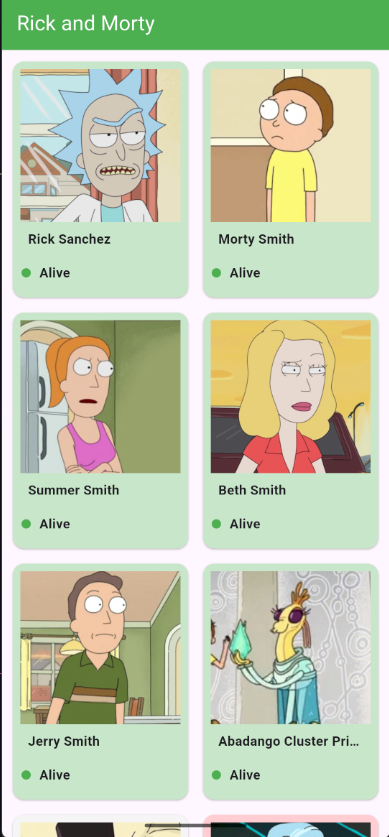
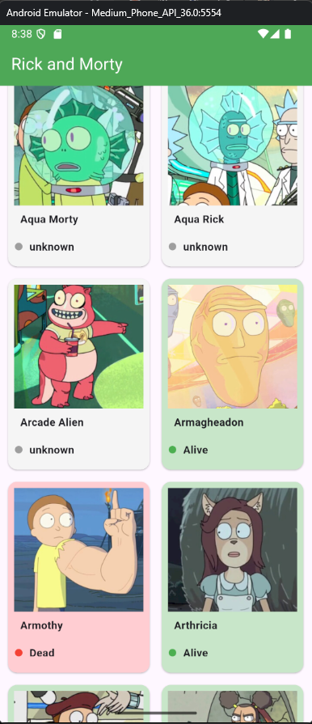
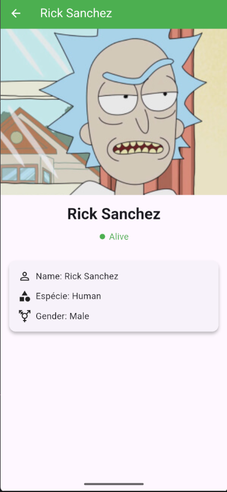

# Rick and Morty Flutter App

A Flutter application that lists characters from the [Rick and Morty API](https://rickandmortyapi.com/) with details, implemented using MVVM architecture and Riverpod for state management.

---

## Features

- List characters with name, status and image
- Character details page showing:
  - Name
  - Status
  - Species
  - Gender
- Infinite scroll / pagination
- Responsive UI with grid layout
- MVVM architecture with Riverpod
- Clean and maintainable code

---

## Screenshots

# Characters List






# Characters Details



---

## Getting Started

### Prerequisites

- Flutter SDK >= 3.0.0
- Dart >= 3.0.0
- Internet connection to fetch data from the API

### Installation

1. Clone the repository:

```bash
git clone https://github.com/MarthinKorb/rick_and_morty_flutter.git
cd rickandmorty_flutter
flutter run
```

## Tecnologias e Arquitetura

Este projeto foi desenvolvido utilizando **Flutter** e **Dart**, permitindo a criação de aplicações móveis **cross-platform** para Android e iOS a partir de um único código-fonte.

### Tecnologias Utilizadas

- **Flutter**: Framework principal para desenvolvimento mobile.
- **Dart**: Linguagem de programação utilizada pelo Flutter.
- **Riverpod**: Gerenciamento de estado moderno, seguro e testável.
- **HTTP**: Para consumo da API REST do [Rick and Morty](https://rickandmortyapi.com/).
- **Cached Network Image**: Para carregamento e cache eficiente das imagens dos personagens.
- **GridView**: Layouts responsivos para exibição de grades de personagens.
- **Async Programming**: Para lidar com dados assíncronos da API.

### Arquitetura

O projeto segue o padrão **MVVM (Model-View-ViewModel)**:

- **Model (Modelos)**: Representa a estrutura de dados da API (por exemplo, `Character`).
- **ViewModel**: Responsável por gerenciar a lógica de negócio e o estado da aplicação (`CharacterListViewModel`, `CharacterDetailViewModel`), permitindo que as views permaneçam reativas e desacopladas.
- **View (Telas/Widgets)**: Componentes visuais que exibem os dados da aplicação (`CharactersListPage`, `CharacterDetailPage`), apenas consumindo o estado fornecido pelos ViewModels.

Essa abordagem garante um código mais **limpo, modular e testável**, facilitando a manutenção e a evolução do aplicativo.
